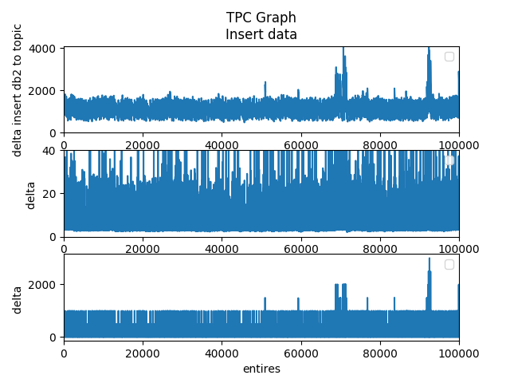
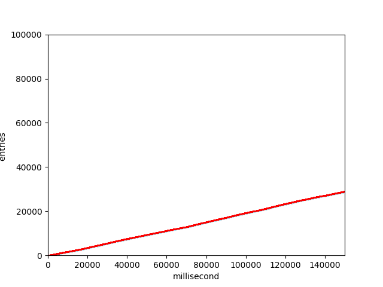
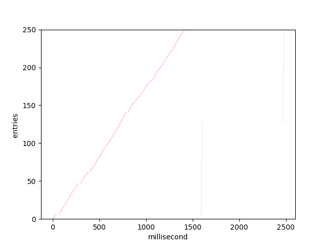
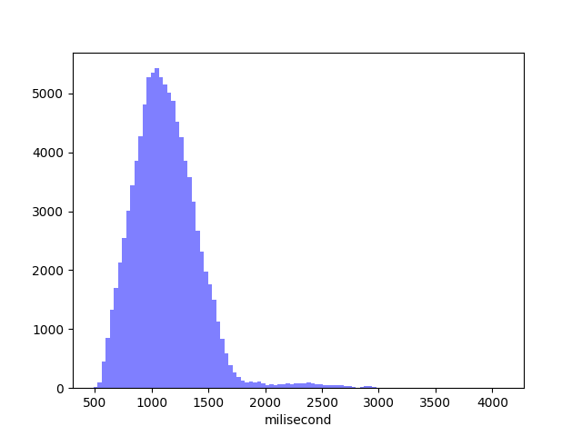

# Debezium End-to-end Benchmark

The E2E benchmark is a Python script that inserts data into a dedicated table in a database. 
One column is a timestamp stating when data is inserted into the table. 
The test compares this time with the time of the corresponding timestamp of the Kafka message in the topic. 
The script creates in the `tpcdata` directory the resulting data in a CSV file and some diagrams in PNG format.






All the SQL statements required to run the tests are specified in the [tpc-config.json](py/tpc-config.json) file. 
The number of commits run and the commit interval of the data is controlled in this part:
```
"tpc": {
        "count": 100000,
        "commit.intervals": [
            1,
            100,
            1000,
            10000
        ]
    },
```

Each entry in the `commit.intervals` array runs one benchmark test. 
This parameter should not be set to very high values.

Test section jdbc is nessesary for the jdbc connection driver information. e.g. 
It need the driver information form "connector.class" in the register.json only

    "jdbc": {
        "db2": {
            "jdbcdriver": "com.ibm.db2.jcc.DB2Driver",
            "jar" : "jcc.jar",
            ....

An additional parameter is needed for a test run in a self-contained environment.
Params for db2 are complete, for other database flavors fill out the form accordingly, please.

            "tpctable": "",
            "initsql": [ ... ],
            "enablecdctablesql": [ ... ]

## Benchmark on existing environment (DB Server / Kafka / Connector)

If you have an existing up and running Debezium environment, you can do the benchmark test by following these steps:

- Build the benchmark docker image
``` docker build -t debezium-benchmark  . ```
- Run the docker container
``` docker run -itd --name benchmark -v <result path>:/home/tpc/tpcdata debezium-benchmark```
- Create the table in your database
    - SQL create table for db2    
``` CREATE TABLE TPC.TEST ( USERNAME VARCHAR(32) NOT NULL, NAME VARCHAR(64), BLOOD_GROUP CHAR(3), RESIDENCE VARCHAR(200), COMPANY VARCHAR(128), ADDRESS VARCHAR(200), BIRTHDATE DATE, SEX CHAR(1), JOB VARCHAR(128), SSN CHAR(11), MAIL VARCHAR(128), ID INTEGER not null GENERATED ALWAYS AS IDENTITY (START WITH 1 INCREMENT BY 1), T0 TIMESTAMP NOT NULL     GENERATED BY DEFAULT     FOR EACH ROW ON UPDATE AS ROW CHANGE TIMESTAMP, PRIMARY KEY (ID) ) ORGANIZE BY ROW ```    
    - SQL create table for SQLServer   
``` CREATE TABLE TPC.TEST ( USERNAME VARCHAR(32) NOT NULL, NAME VARCHAR(64), BLOOD_GROUP CHAR(3), RESIDENCE VARCHAR(200), COMPANY VARCHAR(128), ADDRESS VARCHAR(200), BIRTHDATE DATE, SEX CHAR(1), JOB VARCHAR(128), SSN CHAR(11), MAIL VARCHAR(128), ID INT IDENTITY(1,1) PRIMARY KEY, T0 TIMESTAMP DATETIME NULL DEFAULT GETDATE() ) ``` 
    - SQL create table for MySQL   
``` CREATE TABLE TPC.TEST ( USERNAME VARCHAR(32) NOT NULL, NAME VARCHAR(64), BLOOD_GROUP CHAR(3), RESIDENCE VARCHAR(200), COMPANY VARCHAR(128), ADDRESS VARCHAR(200), BIRTHDATE DATE, SEX CHAR(1), JOB VARCHAR(128), SSN CHAR(11), MAIL VARCHAR(128), ID INTEGER NOT NULL AUTO_INCREMENT, T0 TIMESTAMP  DEFAULT CURRENT_TIMESTAMP ) ``` 

- Include the TPC.TEST table in your Debezium connector config JSON
```  "table.include.list" : "TPC.TEST"   ```

- Enable the table for CDC on the database
    - SQL for db2    
        - ``` CALL ASNCDC.ADDTABLE('TPC','TEST') ```
        - ``` UPDATE ASNCDC.IBMSNAP_CAPPARMS SET COMMIT_INTERVAL=1 , SLEEP_INTERVAL=1 ```  
        - ``` VALUES ASNCDC.ASNCDCSERVICES('reinit','asncdc') ```
        - ``` VALUES ASNCDC.ASNCDCSERVICES('status','asncdc') ``` 
    - SQL for SQLServer    
        - for details see [SQL Server Connector](https://debezium.io/documentation/reference/connectors/sqlserver.html)
    - SQL for MySQL   
        - for details see [MySQL Connector](https://debezium.io/documentation/reference/connectors/mysql.html)

- Login into the docker container
``` docker exec -it benchmark /bin/bash ```
- Copy the Debezium connector configuration JSON in the home directory as `$HOME/register.json`
- Go to the directory where the Python code is
``` cd $HOME/py ```
- Edit the `tpc-config.json` to add the correct debezium.connect.server FQDN:port
- Now run the tests 
``` python3 tpc-run-tes.py ```
- Create plots
``` python3 runplots.py ```


## Benchmark in a self-contained environment

You will need the following to run the tests on CentOS:

```
yum -y install https://dl.fedoraproject.org/pub/epel/epel-release-latest-7.noarch.rpm
yum update
yum -y install wget
yum -y install docker
yum -y install docker-compose
yum -y install maven
yum -y install git
```

### Run a self-contained TPC set up for DB2 with Docker compose

```
export DEBEZIUM_VERSION=1.2
export DEBEZIUM_DB2_VOLUME=$HOME/dockerdata
export DEBEZIUM_TPC_VOLUME=$HOME/tpcdata

mkdir $DEBEZIUM_DB2_VOLUME
mkdir $DEBEZIUM_TPC_VOLUME
chmod 777 $DEBEZIUM_TPC_VOLUME

cd $HOME
git clone https://github.com/debezium/debezium-examples
git clone https://github.com/debezium/debezium

cd debezium/debezium-e2e-benchmark
# if you like do do it with an other db, adapt the docker-compose file to your prefered database and update the tpc-config.json file for appropriate database ( SQL)
docker-compose -f docker-compose-db2-tpc.yaml up --build
```

# Run test and plots

Once everything is set up, to actually run the tests:
```
docker-compose -f docker-compose-db2-tpc.yaml exec tpc bash
python3 tpc-run-test.py 
python3 runplots.py 
```
The results are stored in the DEBEZIUM_TPC_VOLUME directory.

You can check the data flowing in Kafka:
``` 
 /kafka/bin/kafka-topics.sh --bootstrap-server <FQDN bootstrap server>:9092 --list
 /kafka/bin/kafka-topics.sh --bootstrap-server <FQDN bootstrap server>:9092 --topic TESTDB.DB2INST1.CUSTOMERS --delete
 /kafka/bin/kafka-console-consumer.sh --bootstrap-server <FQDN bootstrap server>:9092 --topic CPRODUCER --from-beginning --property print.key=true  --property print.timestamp=true
```
