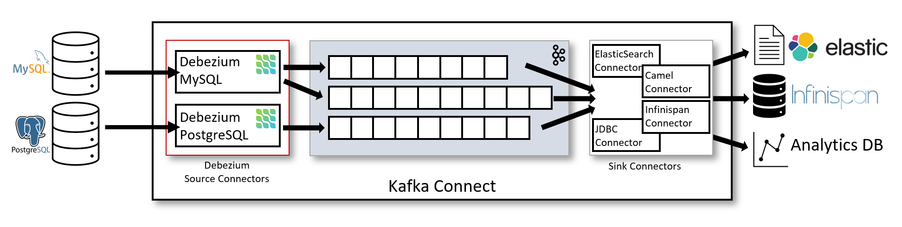

// Metadata created by nebel
//
:isImageReady: false
[id="how-the-mysql-connector-performs-database-snapshots_{context}"]
= How the MySQL connector performs database snapshots

When your {prodname} MySQL connector is first started, it performs an initial _consistent snapshot_ of your database. The following flow describes how this snapshot is completed.

NOTE: This is the default snapshot mode which is set as `inital` in the `snapshot.mode` property. For other snapshots modes, please check out the 

ifeval::["{isImageReady}" == "true"]

endif::[]

:snapshotStep: 0

The connector...::
[cols="1,9"]
|===
|Step |Action

|``{counter:snapshotStep}``
a| Grabs a *global read lock* that blocks _writes_ by other database clients.

NOTE: The snapshot itself does not prevent other clients from applying DDL which might interfere with the connector's attempt to read the binlog position and table schemas. The global read lock is kept while teh binlog position is read before released in a later step.

|``{counter:snapshotStep}``
a| Starts a transaction with link:https://dev.mysql.com/doc/refman/5.6/en/innodb-consistent-read.html[repeatable read semantics] to ensure that all subsequent reads within the transaction are done against the _consistent snapshot_.

|``{counter:snapshotStep}``
a| Reads the current binlog position.

|``{counter:snapshotStep}``
a| Reads the schema of the databases and tables allowed by the connector's configuration.

|``{counter:snapshotStep}``
a| Releases the *global read lock*. This now allows other database clients to write to the database.

|``{counter:snapshotStep}``
a| Writes the DDL changes to the schema change topic, including all necessary `DROP...` and `CREATE...` DDL statements.

NOTE: This happens if applicable.

|``{counter:snapshotStep}``
a| Scans the database tables and generates `CREATE` events on the relevant table-specific Kakfa topics for each row.

|``{counter:snapshotStep}``
a| Commits the transaction.

|``{counter:snapshotStep}``
a| Records the completed snapshot in the connector offsets.

|===

.Additional resources

text
